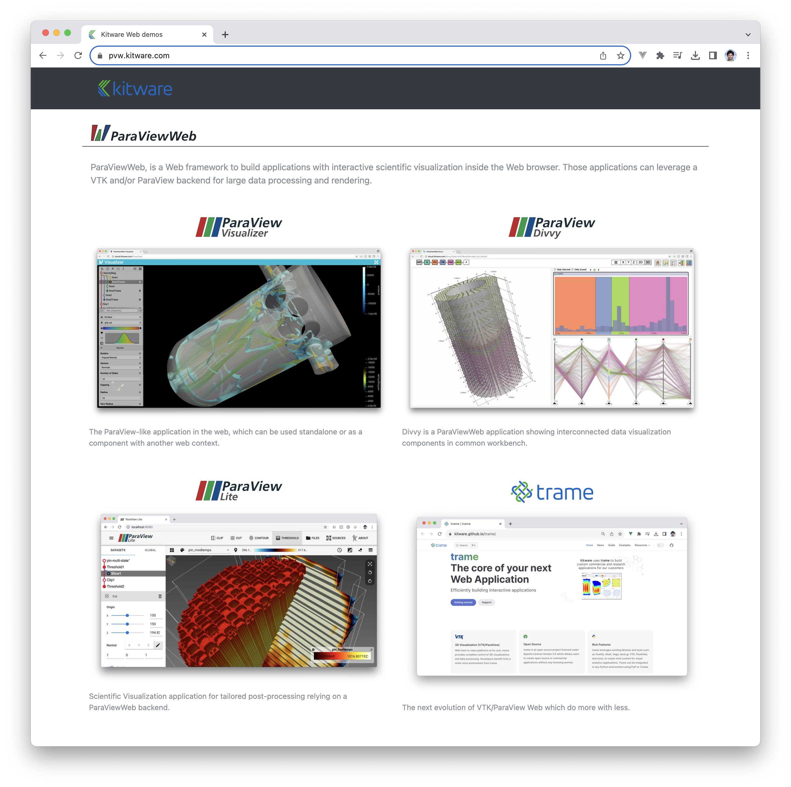

# Introduction

This repository is home to the website and launcher configuration for ParaViewWeb container demos that can be run with the Docker images available on the ParaView DockerHub [repository](https://hub.docker.com/repository/docker/kitware/paraview).

Here is a screenshot of the website, where each screenshot is actually a link to launch an interactive web application within the container.



## Instructions for use

The basic idea is to download a [zip](https://github.com/Kitware/paraviewweb-demo/archive/master.zip) of this repository and unpack into some location on the machine where you want to launch the demo.  Then simply execute a `docker run ...` command line giving the appropriate command-line options, and that's it.

In order for the demo to have any chance of showing something interesting, some data needs to be made available.  In fact, for some of the links from the website to work, there are some requirement about what files are available within the mounted data directory.  At a miminum the data root directory needs to contain the `disk_out_ref.ex2` file available with the ParaView data.

### Detailed Steps

First set some environment variables defining the ParaViewWeb docker image you want to run, and the host/port you want to use:

```
# export IMAGE_TO_RUN="pvw-v5.7.1-osmesa-py2"
# export IMAGE_TO_RUN="pvw-v5.7.1-osmesa-py3"
# export IMAGE_TO_RUN="pvw-v5.7.1-egl-py2"
export IMAGE_TO_RUN="pvw-v5.7.1-egl-py3"
export DEMO_HOST=www.example.com
export DEMO_PORT=9000
```

Then download the demo website and some sample data, and start the demo server.  If you pick an `egl` image to run, you need to invoke `docker` with the `--gpus all` flag.  If you instead choose an `osmesa` image (maybe your machine doesn't have recent enough NVidia graphics card + drivers), you should skip that flag.

```
mkdir -p /path/to/demo
cd /path/to/demo
curl -OL https://github.com/Kitware/paraviewweb-demo/archive/master.zip

curl -OL https://www.paraview.org/files/v4.1/ParaViewData-v4.1.0.zip
unzip ParaViewData-v4.1.0.zip

docker run --rm \
  --gpus all \
  -v /path/to/demo/paraviewweb-demo:/pvw \
  -v /path/to/demo/ParaViewData-v4.1/Data:/data \
  -p 0.0.0.0:9000:80 \
  -e SERVER_NAME="${DEMO_HOST}:${DEMO_PORT}" \
  -e PROTOCOL="ws" \
  -ti ${IMAGE_TO_RUN}
```

Then point your browser at `www.example.com:9000`.

## More Information

For more information on how to run ParaViewWeb applications using the pre-built ParaView Docker images, see the ParaViewWeb [documentation](http://kitware.github.io/paraviewweb/docs).
